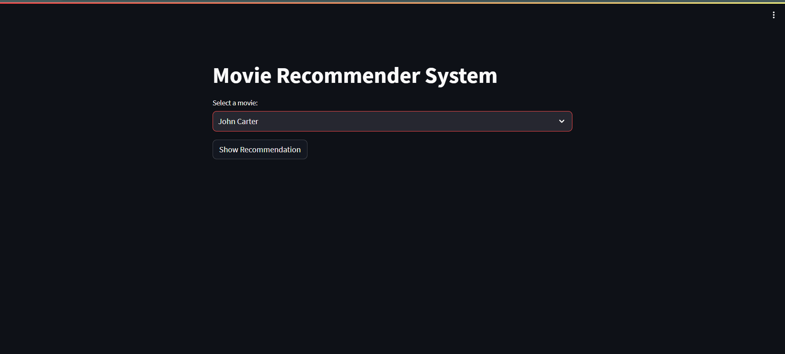
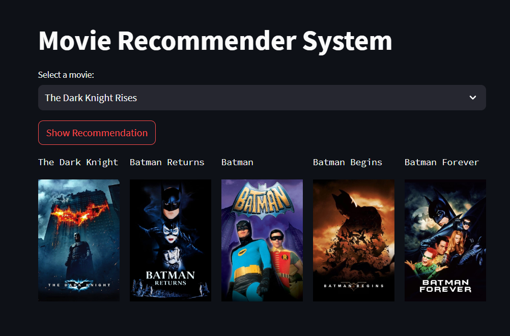
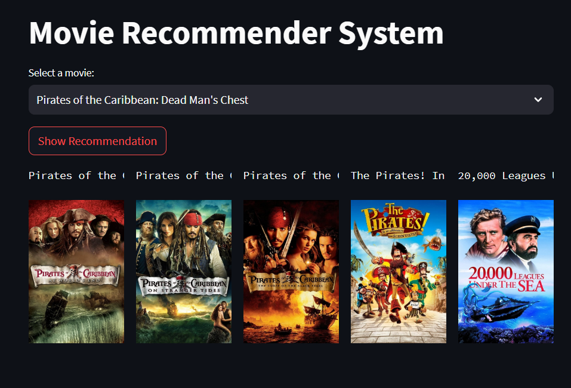

# Movie Recommendation System

Welcome to our Movie Recommendation System, a cutting-edge application driven by state-of-the-art Machine Learning techniques. This system is designed to curate film suggestions based on your unique cinematic inclinations.

## Features

- **Personalized Recommendations:** Input a movie of your choice, and our algorithm will perform a meticulous analysis to recommend films tailored precisely to your preferences.

- **Machine Learning at its Best:** Our recommendation system utilizes state-of-the-art Machine Learning techniques to enhance the accuracy and relevance of movie suggestions.

- **Powered by TMDB 5000 Movie Dataset:** Enriched by the extensive TMDB 5000 Movie Dataset, our system ensures a diverse and comprehensive selection of movies for your immersive cinematic exploration.

- **Developed with PyCharm:** The application is developed using the PyCharm programming environment, ensuring a robust and user-friendly experience.

### Main Interface

*This screenshot showcases the main interface of the application, providing an intuitive user experience for inputting movies.*

### Personalized Recommendations

*In this screenshot, you can see the personalized recommendations generated by our algorithm based on the user's input. Explore and enjoy movies tailored to your cinematic preferences.*

